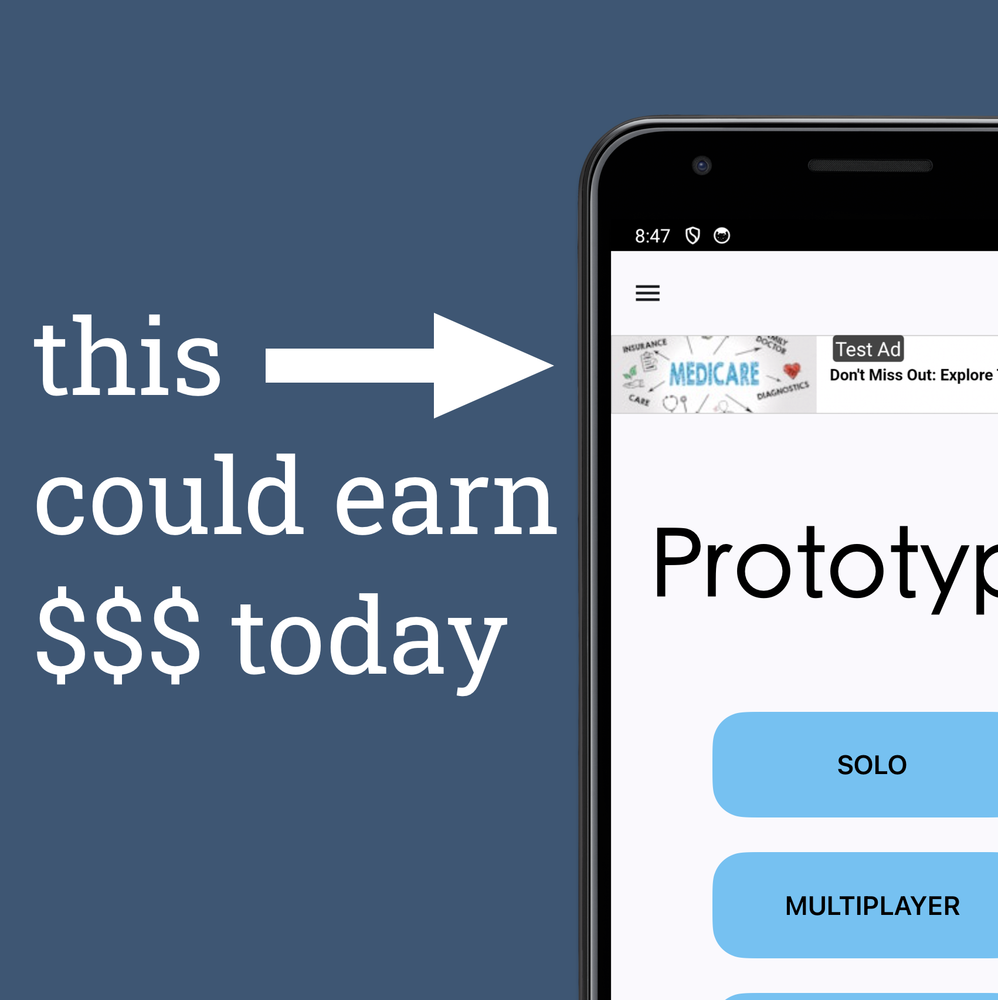
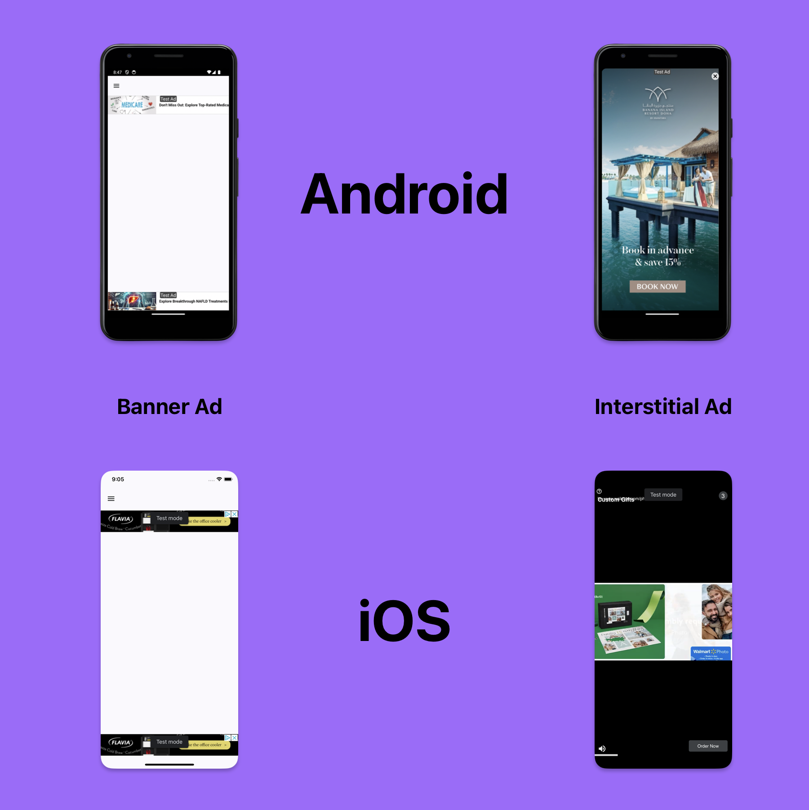

# Kotlin Multiplatform AdMob

A Kotlin Multiplatform template for apps implementing [Basic-Ads](https://github.com/LexiLabs-App/basic) with Compose for Multiplatform. This approach follows the [how-to guide for composable Ads](https://medium.com/@robert.jamison/composable-ads-f8795924aa0d) and the [context factory](https://medium.com/@robert.jamison/passing-android-context-in-kmp-jetpack-compose-8de5b5de7bdd) techniques by [Robert Jamison](https://medium.com/@robert.jamison).

## Composable Types:
* Banner Ads
* Interstitial Ads
* Rewarded Ads
* Rewarded Interstitial Ads __(beta)__

## Dependencies
- 🧩 [Compose Multiplatform](https://github.com/JetBrains/compose-multiplatform); for shared UI
- ♨️ [LexiLabs Basic-Ads](https://basic.lexilabs.app); for porting AdMob into KMP composables
- 💰 [Google AdMob](https://admob.google.com); for Google AdMob functionality
